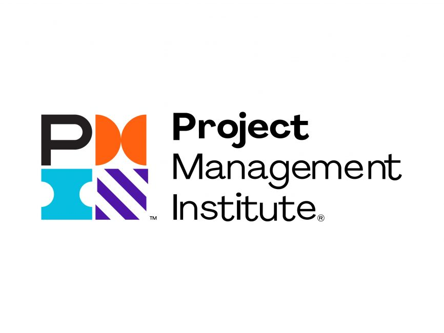

<div align="center">
<!-- HEADER ANIMADO -->

<!-- TYPING SVG -->
<a href="https://github.com/DenverCoder1/readme-typing-svg">
  
</a>
<br/>
</div>

---

## 🧭 About me

```text
🎯 Current Focus     → PMO Strategy · Digital Transformation · Technology Consulting
🏢 Industry          → Higher Education
📍 Location          → Lima, Peru
🌐 Languages         → Spanish (Native) · English (Advanced)
📈 Specialization    → Project Leadership · Agile Delivery · Process Automation
```
Industrial Engineer from National University of Engineering with more than 7 years of experience leading digital transformation projects, process optimization initiatives, and strategic project management across industrial, commercial, and educational sectors.

My profile combines project leadership, agile methodologies, data analytics, and automation, supported by international certifications in Project Management, Agile, Finance, and Business Intelligence.

Currently specializing in PMO, technology consulting, and data-driven solutions, driving initiatives that integrate strategy, innovation, and digital transformation.

---

## 🏅 Certificaciones

<h3>📌 Project Management</h3>

<div align="center">

<table>
<tr>

<td align="center" width="250">



### PMP®

Project Management Professional

🟦 PMI  
📍 Gestión de Proyectos

</td>

<td align="center" width="250">


### Google PM

Professional Certificate

🟦 Google  
📍 Project Management

</td>

</tr>
</table>

</div>

---

<h3>🚀 Agile & Scrum</h3>

<div align="center">

<table>
<tr>

<td align="center" width="250">


### PMI-ACP®

Agile Certified Professional

🟦 PMI  
📍 Agilidad

</td>

<td align="center" width="250">


### PSM II

Professional Scrum Master

🟦 Scrum.org  
📍 Scrum Avanzado

</td>

<td align="center" width="250">


### CSPO®

Certified Scrum Product Owner

🟩 Scrum Alliance  
📍 Product Owner

</td>

</tr>
</table>

</div>

---

<h3>📊 Data & Automation</h3>

<div align="center">

<table>
<tr>

<td align="center" width="250">


### PL-300

Power BI Data Analyst

🟨 Microsoft  
📍 Business Intelligence

</td>

<td align="center" width="250">


### UiPath RPA

Automation Specialist

🟧 UiPath  
📍 Automatización

</td>

<td align="center" width="250">


### IBM DevOps

DevOps & Agile

🟦 IBM  
📍 Cloud & DevOps

</td>

</tr>
</table>

</div>

---

<h3>💰 Finance</h3>

<div align="center">

<table>
<tr>

<td align="center" width="250">


### CFA Level I

Exam Passed

🟥 CFA Institute  
📍 Finanzas

</td>

</tr>
</table>

</div>
---

## ⚙️ Tech Stack & Herramientas

<div align="center">

### 📊 Data & Business Intelligence


### 🤖 Automatización & Low-Code


### 📋 Gestión de Proyectos & Estrategia


### ☁️ Cloud & Herramientas


</div>

---

## 🎯 Áreas de Expertise

<div align="center">

```
┌─────────────────────────┐  ┌─────────────────────────┐  ┌─────────────────────────┐
│   📐 GESTIÓN PMI         │  │   ⚡ METODOLOGÍAS ÁGILES  │  │   📊 DATA ANALYTICS      │
│                         │  │                         │  │                         │
│  • Planificación        │  │  • Scrum / Kanban        │  │  • Power BI Dashboards  │
│  • Control de alcance   │  │  • SAFe Framework        │  │  • KPIs & OKRs          │
│  • Gestión de riesgos   │  │  • Product Backlog       │  │  • Análisis financiero  │
│  • PMO & Portafolios    │  │  • Sprint Planning       │  │  • SQL & Python         │
└─────────────────────────┘  └─────────────────────────┘  └─────────────────────────┘

┌─────────────────────────┐  ┌─────────────────────────┐
│   🔄 TRANSFORMACIÓN DIG. │  │   💰 FINANZAS CORP.      │
│                         │  │                         │
│  • Automatización RPA   │  │  • Modelos financieros  │
│  • Low-Code Apps        │  │  • Análisis costo-benef │
│  • Rediseño de procesos │  │  • Presupuesto & OPEX   │
│  • Gestión del cambio   │  │  • CFA Nivel 1          │
└─────────────────────────┘  └─────────────────────────┘
```

</div>

## 📈 GitHub Stats

<div align="center">
  
  
</div>

---

## 🤝 Conectemos

<div align="center">

[](https://linkedin.com/in/tu-perfil)
[](mailto:diegoram17@gmail.com)
[](https://wa.me/51955567668)

</div>

<br/>

<div align="center">
  <i>💡 "Transformar procesos, liderar equipos y generar valor con datos — esa es mi misión."</i>
</div>

<br/>


